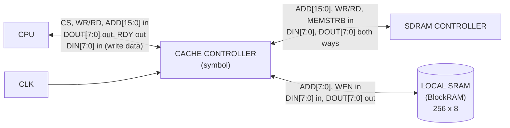

# 1. Cache Controller — Symbol

## What this artifact is
The **symbol** is the top-level entity: the box you place on a bigger schematic.
**External pins only** — the three interfaces from the project spec, plus CLK.
No internals.

## What the course is asking for
As per the initial review of the project requirements, and resulting draft

| Interface | Signals |
|---|---|
| **CPU** | `CS`, `WR/RD`, `ADD[15:0]`, `DIN[7:0]`, `DOUT[7:0]`, `RDY` |
| **SDRAM Controller** | `ADD[15:0]`, `WR/RD`, `MEMSTRB`, `DIN[7:0]`, `DOUT[7:0]` |
| **Local SRAM (BlockRAM)** | `ADD[7:0]`, `DIN[7:0]`, `DOUT[7:0]`, `WEN` |
| **Clock** | `CLK` (shared by all three interfaces) |

## Mermaid draft

## Final Component Symbol
