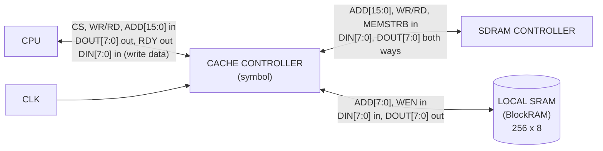

# 1. Cache Controller — Symbol

## What this artifact is
The **symbol** is the top-level entity: the box you place on a bigger schematic.
**External pins only** — the three interfaces from the project spec, plus CLK.
No internals. (Step 2 of the course's 7-step design process: "Symbol Creation —
top-level entity/port declaration for the Cache Controller.")

## What the course is asking for
Per the repo spec, the controller exposes exactly these signals:

| Interface | Signals |
|---|---|
| **CPU** | `CS`, `WR/RD`, `ADD[15:0]`, `DIN[7:0]`, `DOUT[7:0]`, `RDY` |
| **SDRAM Controller** | `ADD[15:0]`, `WR/RD`, `MEMSTRB`, `DIN[7:0]`, `DOUT[7:0]` |
| **Local SRAM (BlockRAM)** | `ADD[7:0]`, `DIN[7:0]`, `DOUT[7:0]`, `WEN` |
| **Clock** | `CLK` (shared by all three interfaces) |

Note the **type-b cache-link** property: the controller sits between the cache and
main memory — the CPU never talks to SDRAM directly; every block transfer is
driven through the controller.

## Mermaid draft

> Adjust:
> - Split the bidirectional lines into separate in/out arrows per signal if the
>   lab wants explicit direction on every pin (e.g., `ADD` = in, `DOUT` = out,
>   `DIN` = in, `RDY` = out).
> - If the handout's symbol is meant as a pure box for VSD/circuit entry, this
>   file doubles as the **port declaration checklist** — verify pin names/bit
>   widths match the spec table above exactly.

## Checklist before submission
- [ ] Pin names + widths match the spec table exactly (`ADD[15:0]`, `ADD[7:0]`, etc.).
- [ ] All 18 interface signals + CLK present, correct directions.
- [ ] No CPU↔SDRAM direct path (type-b property) — controller mediates everything.
- [ ] BlockRAM `ADD[7:0]` width noted (byte address within the 256 B cache).
