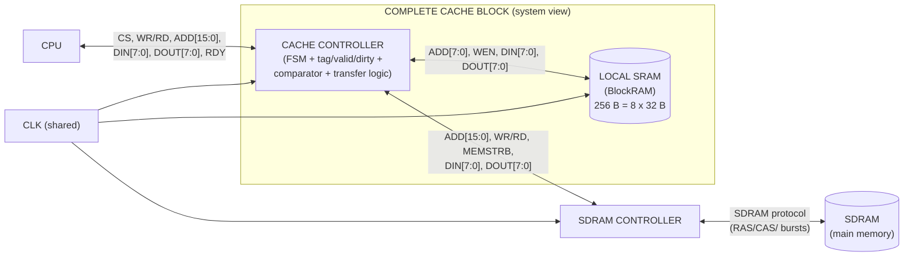
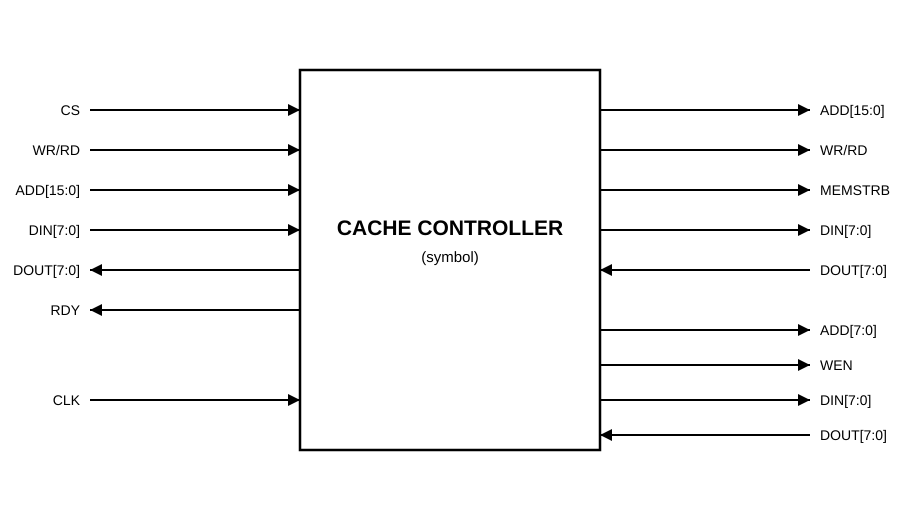
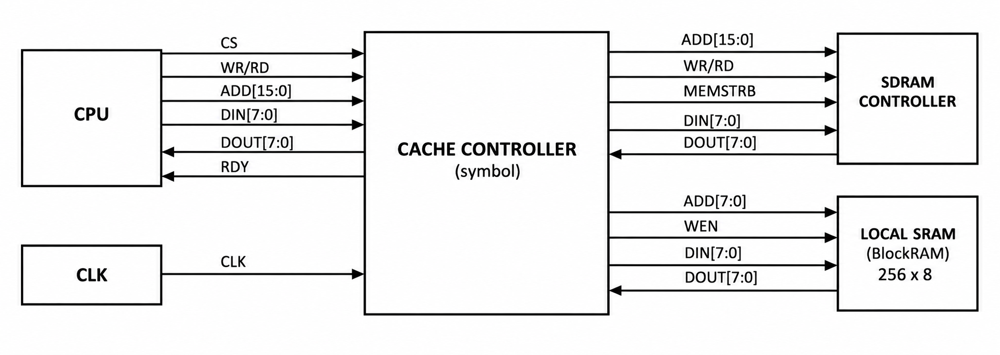

# 1. Cache Controller — Symbol & System Block Diagram

## What this artifact is
The **symbol** is the top-level entity: the box you place on a bigger schematic.
**External pins only** — the three interfaces from the project spec, plus CLK.
No internals. It also contains the **complete Cache block**: CPU on one side; the
controller in the middle; local SRAM (BlockRAM) and the SDRAM controller (and the
SDRAM behind it) on the other. Block level — no gate detail.

## What the course is asking for
As per the initial review of the project requirements, and resulting draft

| Interface | Signals |
|---|---|
| **CPU** | `CS`, `WR/RD`, `ADD[15:0]`, `DIN[7:0]`, `DOUT[7:0]`, `RDY` |
| **SDRAM Controller** | `ADD[15:0]`, `WR/RD`, `MEMSTRB`, `DIN[7:0]`, `DOUT[7:0]` |
| **Local SRAM (BlockRAM)** | `ADD[7:0]`, `DIN[7:0]`, `DOUT[7:0]`, `WEN` |
| **Clock** | `CLK` (shared by all three interfaces) |

- The **CPU only talks to the cache controller** (type-b cache-link: no direct
  link between main memory and the controller — all traffic is mediated).
- The **controller** is the only block that drives the SDRAM-controller
  interface (16-bit addresses, `MEMSTRB` byte enables) *and* the BlockRAM
  interface (8-bit addresses, `WEN`).
- **Local SRAM** = the 256-byte BlockRAM cache body (8 blocks × 32 bytes).
- **SDRAM controller** sits between the cache controller and main memory (SDRAM);
  the block-fetch/write-back traffic flows: controller → SDRAM controller → SDRAM.
- One shared **CLK** across all blocks.
- The four behavioral cases are the *system* behaviors this diagram must be able
  to explain: read/write hit stays inside (CPU ↔ controller ↔ BlockRAM); a miss
  walks out through the SDRAM controller.

## Mermaid draft


## Final Component Symbol



## Code Declaration
```vhdl
entity cacheController is
    Port (
        -- Clock
        CLK      : in  std_logic;
        
        -- CPU Interface
        CPU_CS     : in  std_logic;
        CPU_WR_RD  : in  std_logic;
        CPU_ADD    : in  std_logic_vector(15 downto 0);
        CPU_DIN    : in  std_logic_vector(7 downto 0);
        CPU_DOUT   : out std_logic_vector(7 downto 0);
        CPU_RDY    : out std_logic;
        
        -- SDRAM Controller Interface
        SDRAM_ADD    : out std_logic_vector(15 downto 0);
        SDRAM_WR_RD  : out std_logic;
        SDRAM_MEMSTRB: out std_logic;
        SDRAM_DIN    : out std_logic_vector(7 downto 0);
        SDRAM_DOUT   : in  std_logic_vector(7 downto 0);
        
        -- Local SRAM (BlockRAM) Interface
        SRAM_ADD     : out std_logic_vector(7 downto 0);
        SRAM_WEN     : out std_logic;
        SRAM_DIN     : out std_logic_vector(7 downto 0);
        SRAM_DOUT    : in  std_logic_vector(7 downto 0)
    );
end cacheController;