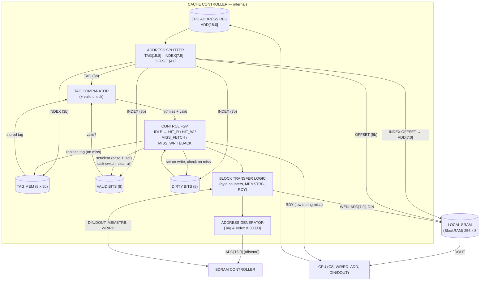

# 2. Cache Controller — Internal Block Diagram

## What this artifact is
Opens the box from artifact #1 and shows the logic *inside* the cache controller:
how the 16-bit address is split, where tag/valid/dirty live, how hit/miss is
decided, and how block transfers are controlled. (Step 3 of the 7-step process:
"Block Diagram & Behavioral Description — FSM, tag/valid/dirty storage,
comparators.")

## What the course is asking for
From the project spec (this repo's `README.md`):

- **Address splitting** of the 16-bit CPU address:
  **Tag [15:8] (8 b) · Index [7:5] (3 b) · Offset [4:0] (5 b)**.
- **Storage: 8 entries each** — tag (8 b), valid (1 b), dirty (1 b) — the repo
  roadmap says "Design tag/valid/dirty storage (8 entries each)."
- **Comparator** — address tag vs stored tag for the indexed entry → hit/miss
  (qualified by the valid bit).
- **FSM** covering the four behavioral cases:
  1. **Write hit** — index/offset → local SRAM write; dirty + valid set.
  2. **Read hit** — index/offset → local SRAM read; data routed to CPU.
  3. **Miss, dirty = 0** — fetch full block from SDRAM at `ADD & 00000` (offset
     zeroed), write into local SRAM, replace tag, set valid → then hit procedure.
  4. **Miss, dirty = 1** — write back old block to SDRAM at
     `[oldTag & Index & 00000]`, fetch new block at `[newTag & Index & 00000]`,
     write to local SRAM, replace tag → then hit procedure.
- **Block-transfer logic** — drives the SDRAM-controller interface (16-bit
  addresses, burst/byte enables via `MEMSTRB`) and the BlockRAM interface
  (8-bit byte addresses, `WEN`).
- **RDY** to the CPU — high when the controller has the data (or accepts a write);
  low while the FSM is mid-miss.

## Mermaid draft

> Adjust:
> - **FSM states**: I listed IDLE → HIT_R / HIT_W / MISS_FETCH / MISS_WRITEBACK.
>   If your design uses a different state breakdown (e.g., a separate
>   `WRITING_BLOCK` count state), swap it in — this diagram is the template, your
>   settled design wins.
> - If the handout wants the **behavioral description as a state diagram** rather
>   than (or alongside) a block diagram, add a `stateDiagram-v2` — same states,
>   transitions labeled with the four cases.

## Checklist before submission
- [ ] Address fields are **8/3/5** (project spec), not the lecture's 12/16/4.
- [ ] Tag/valid/dirty storage shown as **8 entries** each.
- [ ] Miss path shows offset forced to `00000` before SDRAM (both fetch and
      write-back addresses).
- [ ] Dirty=1 replacement order: write-back *first*, then fetch.
- [ ] RDY behavior explained (stalled during miss).
- [ ] Storage structure matches whatever you actually settle on in VHDL.
