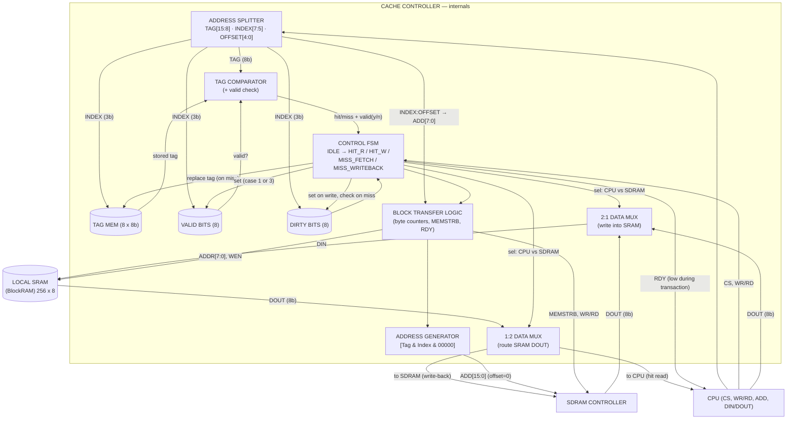
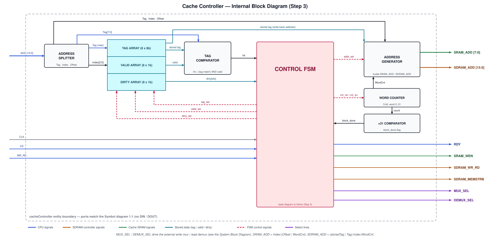

# 2. Cache Controller — Internal Block Diagram

## What this diagram shows
Opens the device and shows the logic *inside* the cache controller:
how the 16-bit address is split, where tag/valid/dirty live, how hit/miss is
decided, and how block transfers are controlled.

## What the course is asking for
From the project spec (this repo's `README.md`):

- **Address splitting** of the 16-bit CPU address:
  **Tag [15:8] (8 b) · Index [7:5] (3 b) · Offset [4:0] (5 b)**.
- **Storage: 8 entries each** — tag (8 b), valid (1 b), dirty (1 b) — the repo
  roadmap says "Design tag/valid/dirty storage (8 entries each)."
- **Comparator** — address tag vs stored tag for the indexed entry → hit/miss
  (qualified by the valid bit).
- **FSM** covering the four behavioral cases:
  1. **Write hit** — index/offset → local SRAM write; dirty + valid set.
  2. **Read hit** — index/offset → local SRAM read; data routed to CPU.
  3. **Miss, dirty = 0** — fetch full block from SDRAM at `ADD & 00000` (offset
     zeroed), write into local SRAM, replace tag, set valid → then hit procedure.
  4. **Miss, dirty = 1** — write back old block to SDRAM at
     `[oldTag & Index & 00000]`, fetch new block at `[newTag & Index & 00000]`,
     write to local SRAM, replace tag → then hit procedure.
- **Block-transfer logic** — drives the SDRAM-controller interface (16-bit
  addresses, burst/byte enables via `MEMSTRB`) and the BlockRAM interface
  (8-bit byte addresses, `WEN`).
- **Write-data mux (2:1)** — selects the SRAM's `DIN` between CPU `DIN`
  (hit write) and SDRAM `DOUT` (miss fetch); controlled by the FSM.
- **Read-data mux (1:2)** — routes SRAM `DOUT` either to the CPU (hit read)
  or to the SDRAM controller (dirty write-back); controlled by the FSM.
- **RDY** to the CPU — high when the controller has the data (or accepts a write);
  low while the FSM is mid-miss.

### Notes

- **Valid bit** — Indicates whether the cache storage contains a **usable block**.
  - `0` → Entry is invalid, the stored tag/data must not be treated as a cache hit.
  - `1` → Entry contains a valid cached block and its tag can be used for hit detection.

- **Dirty bit** — Indicates whether the cached block has been **modified by a CPU write** since it was fetched from SDRAM.
  - `0` → Cache data matches SDRAM, the block can be discarded without writing it back.
  - `1` → Cache data is newer than SDRAM, the block **must be written back to SDRAM before replacement**.

- **Together:**
  - `valid = 0` → No valid cached data.
  - `valid = 1, dirty = 0` → Valid, **clean** block.
  - `valid = 1, dirty = 1` → Valid, **modified/dirty** block requiring write-back on replacement.

## Mermaid draft

## Final Internal Block Diagram
