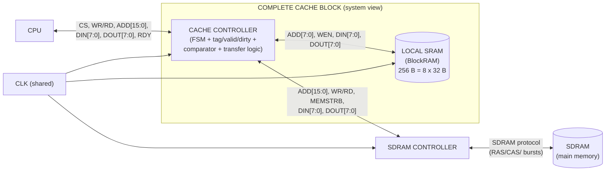

# 3. Cache Controller — System Block Diagram

## What this artifact is
The controller's place in the **complete Cache block**: CPU on one side; the
controller in the middle; local SRAM (BlockRAM) and the SDRAM controller (and the
SDRAM behind it) on the other. Block level — no gate detail. (Step 5 of the
7-step process is "System Integration — combine the controller with the BlockRAM
module into a complete Cache block" — this diagram is that integration view.)

## What the course is asking for
From the project spec + course notes:

- The **CPU only talks to the cache controller** (type-b cache-link: no direct
  link between main memory and the controller — all traffic is mediated).
- The **controller** is the only block that drives the SDRAM-controller
  interface (16-bit addresses, `MEMSTRB` byte enables) *and* the BlockRAM
  interface (8-bit addresses, `WEN`).
- **Local SRAM** = the 256-byte BlockRAM cache body (8 blocks × 32 bytes).
- **SDRAM controller** sits between the cache controller and main memory (SDRAM);
  the block-fetch/write-back traffic flows: controller → SDRAM controller → SDRAM.
- One shared **CLK** across all blocks.
- The four behavioral cases are the *system* behaviors this diagram must be able
  to explain: read/write hit stays inside (CPU ↔ controller ↔ BlockRAM); a miss
  walks out through the SDRAM controller.

## Mermaid draft

> Adjust:
> - If the lab wants the SDRAM drawn as just "MAIN MEMORY" (no separate
>   SDRAM-controller block), collapse `SC` + `DRAM` into one box and note that
>   the SDRAM controller is a separate course module (Tutorial 3 lineage).
> - If the handout expects the I/D (Harvard) view from lectures (instruction +
>   data cache controllers, shared sync line) — that's the *lecture* system
>   diagram; **this project is a single data-path cache**, so the single
>   controller above is the one to submit. Worth a sentence in the lab doc
>   clarifying the scope.

## Checklist before submission
- [ ] Shows CPU, controller, local SRAM, SDRAM controller, SDRAM as blocks.
- [ ] Type-b property visible: CPU never touches SDRAM/SDRAM-controller directly.
- [ ] All three interface signal groups labeled on the lines (from the spec table).
- [ ] Shared CLK shown.
- [ ] One or two sentences of behavioral explanation (hit stays in, miss walks
      out) — this is the "block diagram & behavioral description" pair.
